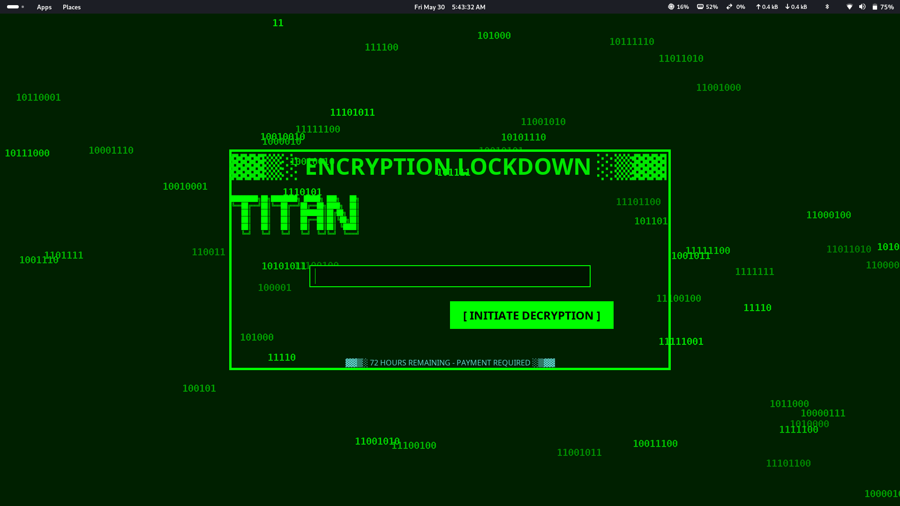

# 🛡️ TITAN - Ransomware Simulation Tool (Java)



**TITAN** is a simulated ransomware program written in Java for educational and research purposes. It demonstrates key aspects of ransomware behavior such as file discovery, encryption, OS targeting, and a fullscreen graphical warning interface, mimicking real-world ransomware attacks in a safe environment.

> ⚠️ **WARNING:** This program performs real encryption and file deletion. **Use only in a virtual machine or sandbox environment with test files. Do not run on a personal or production system.**

---

## 🚨 Disclaimer

**TITAN is intended solely for educational use, malware analysis practice, and controlled cybersecurity testing.**

Running this program on systems you do not own or have permission to test is unethical and may violate the law. The authors and contributors assume **no responsibility** for misuse or damages caused by this software.

---

## 🧩 Features

- 🧠 OS Detection (Windows, Linux, Mac, Android, ChromeOS)
- 🔍 Scans user directories for common sensitive file types
- 🔐 AES-style file encryption & simulated decryption (via `CryptoUtils`)
- 🖥️ Custom fullscreen Matrix-style ransom GUI
- 🧾 Hardcoded encryption key: `Optimus_Was_here`
- 🔁 Decryption simulation if correct key is entered
- 🛑 Visual effects: glitching title, binary rain, warning timers, error messages

---

## 📂 Targeted File Types

- `pdf`, `doc`, `docx`, `txt`, `xls`, `sql`, `odt`
- Images: `jpg`, `jpeg`, `png`, `bmp`
- Media: `mp3`, `mp4`, `avi`, `mkv`
- Archives: `zip`, `rar`
- Certificates: `cert`

Files found in the `Documents` directory will be encrypted and deleted, then replaced with `.encrypted` files.

---

## ⚙️ Requirements

- Java 22+
---

## 📦 Dependencies

- Java 22+

---

## 🏁 Running TITAN

```bash
java -jar Titan.jar
